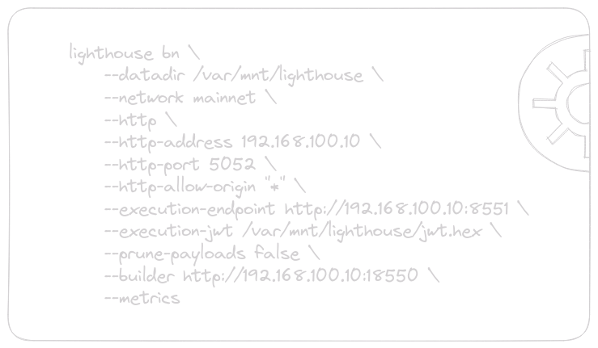

# Client Configurations

There are several Ethereum clients out there and figuring out how to set them up can be confusing, especially with all the different APIs. To make things easier for you, we've provided some essential information on the configuration options of an Ethereum client when you're just getting started.

Here is a list of commonly used clients and links to their documentation:


**Execution Clients** <br/>
- [Nethermind](https://docs.nethermind.io/nethermind/ethereum-client/configuration)
- [Erigon](https://erigon.gitbook.io/erigon/advanced-usage/command-line-options)
- [Geth](https://geth.ethereum.org/docs/fundamentals/command-line-options)
- [Besu](https://besu.hyperledger.org/stable/public-networks/reference/cli/options)

**Consensus Clients**
- [Lighthouse](https://lighthouse-book.sigmaprime.io/)
- [Lodestar](https://chainsafe.github.io/lodestar/reference/cli/)
- [Prysm](https://docs.prylabs.network/docs/prysm-usage/parameters)
- [Nimbus](https://nimbus.guide/options.html)
- [Teku](https://docs.teku.consensys.net/reference/cli)

<br/>

When you are deciding which clients to use, please consider using a minority client to improve the Ethereum's resilience. You can check the client distribution at [clientdiversity.org](https://clientdiversity.org/#distribution).

### Basic Configuration Settings

- “**Data Directory**” - This refers to the location on disk where the Ethereum client stores its database, including all blocks, transactions and other information.

- “**Network**” - There are multiple networks, such as the mainnet and testnets like [Sepolia](https://sepolia.dev/) and [Goerli](https://goerli.net/). It's important to specify which Ethereum network the client should connect to.

- “**JWT Secret**” - JSON Web Tokens (JWT) are commonly used for authentication and authorization in web applications and APIs. In the context of Ethereum client configuration, JWT Secret is utilized for authentication between Ethereum clients. To enable communication between the clients, they should share the same JWT Secret. 

- “**Pruning**” - Pruning is the process of erasing historical transaction records and smart contract states that have been processed in order to save disk space. Do not try to prune an archive node, since the archive nodes need to maintain ALL historic data by definition.

- “**Metrics / Monitoring**” - This feature allows you to collect and monitor performance-related data and statistics from your Ethereum client. Typically, these metrics are saved to the data directory of the client.

### Communication Interfaces

In order for a software application, users and other clients to interact with the Ethereum client, it must have a means of communication. This is most commonly achieved by using a JSON-RPC API, which is a remote procedure call (RPC) protocol where requests and responses are formatted as JSON objects.

Here's a simple example of how you can use a tool called `curl` to get the Ethereum client's version using the HTTP JSON-RPC:

```shell
curl -X POST -H "Content-Type: application/json" --data '{"jsonrpc":"2.0", "method":"web3_clientVersion", "params":[], "id":1}' http://192.168.100.10:8545
```

Response could look something like this:
```json
{"jsonrpc":"2.0","id":1,"result":"erigon/2.48.1/linux-amd64/go1.20.6"}
```

The Ethereum client can be configured to have multiple interfaces to achieve communication, each serving its specific purpose:

- “**Engine RPC**” - This interface allows clients to communicate with each other, enabling essential interactions, such as communication between a node's execution client and the consensus client. The default ports for the Engine RPC are 8551 for execution clients and 5052 for consensus clients.

- “**HTTP JSON-RPC**” - This interface is the most common way for applications or users to interact with an Ethereum node. When a execution client exposes this interface, you can send HTTP requests (typically POST requests), like the one demonstrated above with `curl`, to perform actions like sending transactions and querying blockchain data. The requests and responses are formatted as JSON objects. The default port for the HTTP JSON-RPC interface is 8545.

- “**WebSockets**” - Similar to the HTTP JSON-RPC API, but operating over WebSockets (WS). They maintain a persistent, bidirectional connection, which can lead to lower latency and more efficient real-time communication, making it ideal for applications that require constant data streams or continuous monitoring of blockchain events. The default port for the WebSockets interface is 8546.

Each of the interfaces usually has options to set the address, port and allowed hosts. Allowed hosts are often referred in a manner like "corsdomain" or "allow-origins" in the client configuration options. 

For more comprehensive information about the JSON-RPC APIs, visit: https://ethereum.org/en/developers/docs/apis/json-rpc/

### Consensus Clients

In addition for basic settings and communication interfaces, consensus clients may have some unique configuration options such as:

- “**Execution Endpoint**” - The consensus client needs to send execution requests to an execution client, so the address for the execution client must be defined.

- “**Slasher**” -  This refers to a part in the proof-of-stake consensus mechanism that penalizes validators for malicious behavior or double-signing blocks. It imposes a penalty by deducting a portion of a validator's staked cryptocurrency, discouraging fraudulent activities and preserving the integrity of the consensus mechanism.

- “**Builder ([MEV-Boost](https://docs.flashbots.net/flashbots-mev-boost/introduction))**” - Maximal Extractable Value (MEV) refers to the process of strategically manipulating the order of transaction execution to maximize profits for validators.