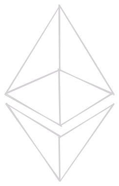
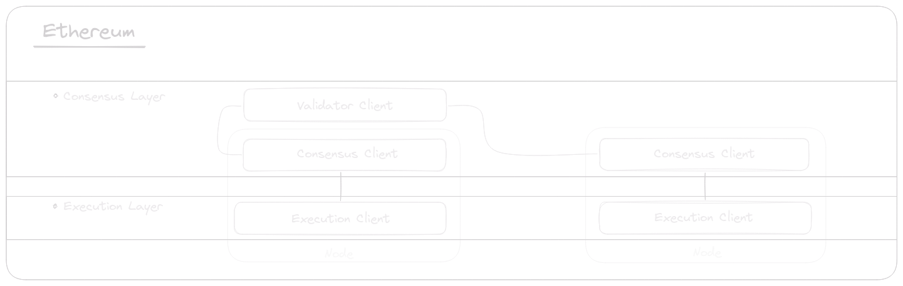

# What is Ethereum?

The Ethereum network is a decentralized peer-to-peer network that processes Ethereum blocks and transactions. Ethereum's primary purpose is not just as a digital currency. It serves as a global, open-source computer that allows developers to build decentralized applications, which range from games to financial services. Powered by Ethereum's native cryptocurrency, Ether (ETH).

### Networks

The Ethereum network that hosts real-world applications is referred to as **Ethereum Mainnet**. Ethereum Mainnet is the live, production instance of Ethereum dedicated to managing real ETH and holds real monetary value.

There are other live test instances of Ethereum dedicated to managing test ETH. Each network is compatible with (and only with) its own type of currency. These test networks allow developers and participants to test functionality before using real ETH on the Mainnet.

Every Ethereum network is divided into two layers:

- **Execution Layer (EL):** The execution layer is responsible for processing transactions and executing smart contracts. It handles the computation and processing of code and data within the Ethereum network.

- **Consensus Layer (CL):** The consensus layer is responsible for reaching agreement on the state of the Ethereum blockchain among all participating nodes. It ensures that all nodes have the same view of the blockchain and agree on the order of transactions.
  
### Nodes and Clients

The Ethereum network consists of Ethereum nodes. An Ethereum node is a running instance of Ethereum software that consists of two components: an **execution client** and a **consensus client**. These clients are a part of their respective layers within the Ethereum network.

 

The consensus clients can also function as **validator clients**, which are also a part of the Ethereum's consensus mechanism. Validators, as the name suggests, are responsible of validating new blocks of transactions. The validator client connects to the Ethereum network's CL trough the **consensus client**, and it is possible for a these clients to perform the roles of both a consensus client and a validator client simultaneously.

Running a validator can be a way for individuals to earn income while contributing to Ethereum's security and decentralization. To participate in Ethereum's proof-of-stake consensus mechanism and have the opportunity to earn a profit, a validator requires staking 32 ETH to be activated.

Profit mainly comes from:

- **Block Rewards:** Validators receive a portion of newly created ETH tokens as block rewards. These rewards are distributed to validators for their role in proposing and validating new blocks on the blockchain.

-  **Transaction Fees:** Validators also collect transaction fees paid by users for executing smart contracts and conducting transactions. These fees are an additional source of income for validators.
  
### Syncing

Syncing with a network refers to the process of downloading or updating the blockchain data from the network. Once the node is fully synced, it can participate in the network and interact with other nodes, smart contracts and decentralized applications on the network. There are multiple types of sync modes that represent different approaches to this process, each with various trade-offs.

As of September 18, 2023, the Ethereum blockchain's **full sync** data size is **1221.43 GB**. It is important to note that the size depends on several factors, such as the client and filesystem you are using. The full sync data size can potentially be reduced by using a [COW](https://en.wikipedia.org/wiki/Copy-on-write) filesystem and a compression method.

### Want to know more?

- https://ethereum.org/en/learn/

- https://docs.prylabs.network/docs/concepts/nodes-networks